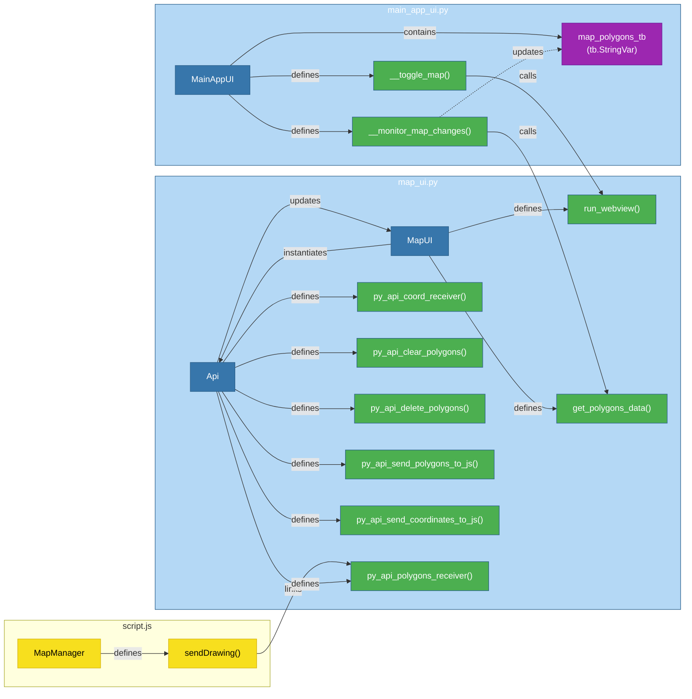

# Risk Screening System (RSS)

## Overview

This is a Python-based implementation of the **Risk Screening System (RSS)**, originally developed by the [New Zealand Ministry for the Environment](https://environment.govt.nz/publications/contaminated-land-management-guidelines-no-3-risk-screening-system/).

The Risk Screening System (RSS) evaluates environmental risks using a risk equation composed of three key components:

1. **Hazard (Source)**: The origin of the potential contamination.
2. **Exposure Pathway**: The route through which the hazard reaches the receptor.
3. **Receptor**: The entity (e.g., human, ecosystem) that may be affected by the hazard.

This framework is commonly referred to as the **Source-Pathway-Receptor (SPR)** model.

## References

- **New Zealand Ministry for the Environment**: [Contaminated Land Management Guidelines No. 3 – Risk Screening System](https://environment.govt.nz/publications/contaminated-land-management-guidelines-no-3-risk-screening-system/)
- **Source-Pathway-Receptor (SPR) Model**: A foundational framework for environmental risk assessment.

### Scoring in this implementation

Every input is a dropdown selection mapped to a weight between 0 and 1 (defined in `rss_islandr/data/risk_factors.json` and `receptor_factors.json`). For each receptor the score is `hazard × pathway × receptor`, where the hazard is toxicity × extent and the pathway is the product of its own parameters. The result is shown as a percentage (green < 10 %, yellow 10–30 %, red > 30 %). "Value Not Known" has weight 0 and is the default, so any parameter left unanswered gives a score of 0 %.

This is an adaptation of the NZ Ministry for the Environment method and not an identical copy: the air and sediment pathways, the per-receptor pathway selection and the 10 % / 30 % thresholds are specific to this tool, and no overall worst-case site ranking is computed. The tool is intended for **screening** (desk study and prioritisation), not for detailed quantitative risk assessment.

## Requirements

- **Operating system:** Windows 10/11 (the standalone executable is built for Windows only). From source it also runs on Linux (tested on Ubuntu with the Qt web engine, installed automatically). macOS is untested.
- **Python:** 3.12 to 3.14 (`>=3.12,<3.15`), only when running from source.
- **Microsoft Edge WebView2 runtime (Windows):** needed by the map viewer (preinstalled on current Windows 10/11).
- **Excel reports:** written with `openpyxl`, so Microsoft Excel is **not** required (any spreadsheet program can open the `.xlsx`).
- **Internet connection:** needed only for the Map Viewer (OpenStreetMap tiles, WMS layers and two CDN resources). Everything else works offline.

## Versions

- The only version of the app is `version` in `pyproject.toml` (format `X.Y.Z`). It is updated by hand and is also used for the metadata of the built executable.

---

## Codebase

### Downloading the repository

This is a public project on GitHub and can be downloaded by anyone. Use the following command:

```bash
git clone https://github.com/GMECH7/rss_islandr.git
```

### Setup virtual environment & install dependencies

Navigate to the project directory:

```shell
cd <local-project-directory>
```

#### 1. Using poetry

If `poetry` is installed the following command can be used to setup the virtual environment and install all dependencies.

```shell
poetry install
```

#### 2. Using pip

In case that `poetry` is not installed, the following steps have to be followed:
a. **Create virtual environment**

```shell
python -m venv .venv
```

b. **Activate the virtual environment**:

- If you are using **Visual Studio Code (VSC)**, the virtual environment should activate automatically due to the presence of the `.vscode/settings.json` file.
- Otherwise, activate the environment manually:
  - On **Windows**:
    ```bash
    .venv\Scripts\activate
    ```
  - On **macOS/Linux**:
    ```bash
    source .venv/bin/activate
    ```

c. **Install dependencies using pip (depends on `requirements.txt`)**

```bash
pip install -r requirements.txt
```

#### Advantages & disadvantages of poetry over pip

### ✅ Advantages

- **Reproducible environments**:  
  `poetry.lock` guarantees exact dependency versions used in development
- **Dependency resolution**: Handles complex dependency graphs better than pip
- **All-in-one tool**: Manages virtualenvs, packaging, and publishing

### ⚠️ Disadvantages

- **Environment conflicts**: Potential confusion with Anaconda/manual virtualenvs
- **Learning curve**: Different workflow from standard pip/virtualenv

#### Useful notes

1. **Regarding Windows & VSC integration:**

   - Use `Windows powershell` (not `Anaconda powershell`) to open VSC.
   - If VSC is opened through `Anaconda powershell` there may be difficulties in activating the virtual environment.

2. **Checking local environments:**

   - Make sure that poetry "sees" the rss_islandr environment. For that make use of the `poetry env info` command.

3. **More on poetry & pip**:

   - The package itself will not be shown after executing `poetry show` since this command visualizes only the dependencies of the `pyproject.toml` file. Instead the `poetry version` command should return the installed version of the package. Also the validation of the installation can be done by typing `pip list` command, which should return all packages installed in the virtual environment.

   - The installation of package through `poetry`is being made in editable mode.

   - If a new package is needed then the following commands are to be used:
     ```bash
     poetry add <package name> --dry-run # checks installation for conflicts
     poetry add <package name> # Adds the new dependency to .toml while installing in venv
     poetry remove <package name>
     or
     pip uninstall <package name>
     poetry show --tree # shows dependencies relationships
     ```

### Project layout

| Folder / file | Contents |
|---|---|
| `rss_islandr/` | The app: `app.py` (start-up and command line options), `ui/`, `core/`, `assessment/`, `reporting/`, `data/` (weights as JSON), `maps/` (Leaflet map), `templates/` (Excel template), `self_test.py` |
| `dev_scripts/` | Scripts used while developing. Each one is a Poetry command (see below) |
| `build_installer/` | Everything that creates the installers: the `rss-build` code, `docker/` (Ubuntu 24.04 build image and script), `installer/islandr.iss` (Inno Setup script of the Windows installer) and the PyInstaller hook |
| `tests/` | The tests, in one folder per part of the code: `app/`, `assessment/`, `build_installer/`, `core/`, `dev_scripts/`, `ui/` |
| `main.py`, `islandr.spec` | Entry point of the app and the PyInstaller specification |
| `pyproject.toml`, `poetry.lock` | Dependencies (Poetry), the commands below and the version of the app |

### Poetry commands

Run all commands from the project folder after `poetry install --with build,dev`.

| Command | What it does |
|---|---|
| `poetry run islandr` | Starts the app (the same as `python main.py`). `--self-test` checks the installation instead (see below) |
| `poetry run pytest` | Runs the tests. Coverage reports are written to `.cov_files/`, and the UI tests need a display |
| `poetry run clean` | Removes the generated files (`dist/`, `build/`, `.cov_files/`, caches, `rss_islandr.log`, `version_info.txt`). `--dry-run` only shows them. It deletes the built installers in `dist/` as well, but never `.venv/` |
| `poetry run rss-build --win` | On Windows: creates `dist/islandr-setup.exe` and `dist/islandr-portable.zip` |
| `poetry run rss-build --deb --docker` | On Linux: creates `dist/rss-islandr_<version>_amd64.deb` in an Ubuntu 24.04 container (needs Docker) |
| `poetry run rss-build --deb` | The same without Docker, built with the local system |
| `poetry run rss-build --test-deb` | Installs `dist/*.deb` in clean Ubuntu 24.04 and 26.04 containers and tests it |

### Running, testing and building

- **Run the application:** `poetry run islandr` (or `python main.py`).
- **Run the tests:** `poetry run pytest`.
- **Build the installers** with `rss-build` (commands above). The version comes from `version` in `pyproject.toml`, and each build ends with a self-test of the built application.
  - **Windows:** needs [Inno Setup 6](https://jrsoftware.org/isinfo.php) (`ISCC.exe`) for the installer. The script is `build_installer/installer/islandr.iss`.
  - **Debian package:** for Ubuntu 24.04 and later (`build_installer/docker/Dockerfile.build` is the build environment). It installs the app to `/opt/rss-islandr`, the command `rss-islandr` and a menu entry.
  - Under the hood `rss-build` creates `version_info.txt` (Windows file properties) and runs PyInstaller with `islandr.spec` (one-folder build in `dist/islandr/`).
- **Check an installation** (works for the source version and for the built application; exit code 0 = OK, `--self-test-report FILE` also writes the result to a file):

  ```bash
  poetry run islandr --self-test
  dist/islandr/islandr --self-test
  ```

- **Desktop input method on Linux:** the app switches the X11 input method (ibus) off, because it makes the window take minutes to build. Set `RSS_KEEP_INPUT_METHOD=1` to keep it.

### GitHub Actions and releases

Two workflows are in `.github/workflows/`:

| Workflow | Runs | What it does |
|---|---|---|
| `ci.yml` (Tests) | On every push, and on pull requests to `main` | `pytest` on Ubuntu 24.04 and Windows |
| `release.yml` (Installers) | On pushes to `main` (and to `makge/publication` for now), and with the **Run workflow** button in the Actions tab | Builds and tests the Ubuntu package (`--deb --docker`, then `--test-deb`) and the Windows installer and portable zip (`--win`, then silent install, self-test and uninstall) |

- **Releases:** a push to `main` also creates the GitHub release `v<version>` (version in `pyproject.toml`) with `islandr-setup.exe`, `islandr-portable.zip`, the `.deb` and `SHA256SUMS.txt`, **if that release does not exist yet**. To publish a new version, change `version` in `pyproject.toml` and merge to `main`. Releases do not expire and are the download page for users: `https://github.com/GMECH7/rss_islandr/releases`.
- **Other runs** (other branches, the button) build and test only. The files are on the run page in the Actions tab, under *Artifacts*, for 14 days. The run page also shows a table with file sizes and SHA-256 checksums.
- **Reproducibility:** pinned runner images (`ubuntu-24.04`, `windows-2022`), Python 3.12, Poetry 2.4.1 with `poetry.lock`, Inno Setup 6.7.1, and the Ubuntu 24.04 build container.

---

# 🗺️ Maps Viewer - Geology, Mines & Hydrogeology

The map viewer option of this app is built using [Leaflet.js](https://leafletjs.com/) and displays various geospatial layers using WMS (Web Map Service).

## 🌐 Map Services Used

#### Geological maps

- ##### 1. Geological Survey of Slovenia (GeoZS)

  - **Service URL:** `https://geoserver.geo-zs.si/egdi-surface-geology/gsmlp/wms`
  - **Layer Name:** `gsmlp:GeologicUnitView_Lithology`

- ##### 2. BGR: 1:5 Million International Geological Map of Europe and Adjacent Areas (IGME5000)

  - **Service URL:** `https://services.bgr.de/wms/geologie/igme5000/`
  - **Layer Names:** `3,5,6,8,10,11,13,14,15,16,17,18,19,20,22,23,24,27,29,31,33,37,39,41,43,44,46,47,48,51,53,55,57`

- ##### 3. BGR: International Geological Map of Europe and the Mediterranean Regions 1:1,500,000 (IGME1500)

  - **Service URL:** `https://services.bgr.de/wms/geologie/igk1500/`
  - **Layer Names:** `0,1,2`

- ##### 4. BGR: International Quaternary Map of Europe 1:2,500,000 (IQUAME 2500)

  - **Service URL:** `https://services.bgr.de/wms/geologie/iqe2500/`
  - **Layer Names:** `0,1`

#### Minerals resources maps

- ##### 1. Mines of Europe

  - **Service URL:** `https://data.geus.dk/egdi/wms/`
  - **Layer Name:** `egdi_mines`

#### Hydrogeological maps

- ##### 1. BGR & UNESCO (eds.) (2019): International Hydrogeological Map of Europe 1:1,500,000 (IHME1500)

  - **Service URL:** `https://services.bgr.de/wms/grundwasser/ihme1500/`
  - **Layer Names:** `0,1,2`

- ##### 2. BGR: Groundwater Resources of the World (WHYMAP GWR) (WMS)

  - **Service URL:** `https://services.bgr.de/wms/grundwasser/whymap_gwr/`
  - **Layer Names:** `0`

- ##### 3. BGR: Natural Radionuclides in Groundwater

  - **Service URL:** `https://services.bgr.de/wms/grundwasser/norm/`
  - **Layer Names:** `1,2,3,4,6,7`

- ##### 4. BGR: River and Groundwater Basins of the World (WHYMAP RGWB)

  - **Service URL:** `https://services.bgr.de/wms/grundwasser/whymap_rgwb/`
  - **Layer Names:** `0,1,3,4,5`

- ##### 5. BGR: World Karst Aquifer Map (WHYMAP WOKAM)

  - **Service URL:** `https://services.bgr.de/wms/grundwasser/whymap_wokam/`
  - **Layer Names:** `0,1,2,3,4,5,6`

#### Soil maps

- ##### 1. BGR: Soil Regions of the European Union and Adjacent Countries 1:5,000,000 (WMS)

  - **Service URL:** `https://services.bgr.de/wms/boden/eusr5000/`
  - **Layer Names:** `1,3,5`

#### Hydrological maps

- ##### 1. European River Network Generated using European Union's Copernicus Land Monitoring Service information

  - **Service URL:** `https://image.discomap.eea.europa.eu/arcgis/services/EUHydro/EUHydro_RiverNetworkDatabase/MapServer/WMSServer`
  - **Layer Names:** `0,1,2,3,4,5`

#### Links

Overview of the BGR web services: <https://services.bgr.de/uebersicht/kurzlinks>

## ➕ How to Add New Map Layers

To add additional WMS layers:

1. Open the `script.js` file.

2. Add a new WMS layer in the `const WMS_LAYERS` following the implemented structure.

## 🔍 How to Find Available Map Layers (WMS)

Follow these steps to discover what layers are available in any WMS service:

### 1. 🧭 Get the GetCapabilities URL

Every WMS service provides a `GetCapabilities` endpoint that returns an XML file describing all available layers.

**Format:**
`your-wms-server-url` `?service=WMS&request=GetCapabilities`

**Examples:**

- [Geological Survey of Slovenia (GeoZS)](https://geoserver.geo-zs.si/egdi-surface-geology/gsmlp/wms?service=WMS&request=GetCapabilities)
- [Mintell4EU Project](https://data.geus.dk/egdi/wms/?service=WMS&request=GetCapabilities)
- [Hydrogeology WMS](https://services.bgr.de/wms/grundwasser/ihme1500/?service=WMS&request=GetCapabilities)

### 2. 🔎 Open the URL in Your Browser

Opening the URL shows an **XML document** with many `<Layer>` entries. Look for:

```xml
<Layer>
  <Name>your_layer_name</Name>
  <Title>Human-readable title</Title>
</Layer>
```

```html
- Use the <Name> value in your WMS layer config
- <Title> helps identify what the layer represents
```

---

## Flowcharts

Below flowcharts showcasing the logic behind key software components are provided.

### Design and update polygons on map



---

## Acknowledgements

Funded by the European Union, Grant agreement n°1001112889 (ISLANDR project).

Views and opinions expressed are however those of the author(s) only and do not necessarily reflect those of the European Union or the European Climate, Infrastructure and Environment Executive Agency (CINEA). Neither the European Union nor the granting authority can be held responsible for them.

## License

This project is released under the [MIT License](LICENSE). Copyright (c) 2025 CERTH.
