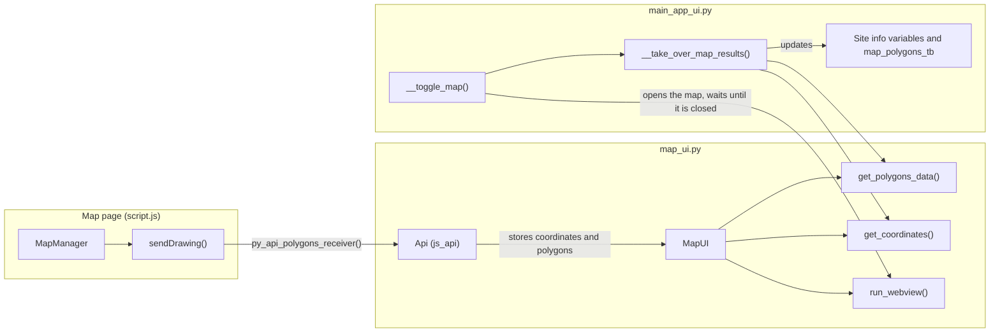

# Features

This document describes what the application does: the risk screening method, the pages of the application, the map viewer and the files it reads and writes.

Contents

1. [Purpose and scope](#1-purpose-and-scope)
2. [Method: source, pathway, receptor](#2-method-source-pathway-receptor)
3. [Pages of the application](#3-pages-of-the-application)
4. [Input parameters and weights](#4-input-parameters-and-weights)
5. [Scoring and results](#5-scoring-and-results)
6. [Site information](#6-site-information)
7. [Map viewer](#7-map-viewer)
8. [Files and reports](#8-files-and-reports)
9. [Limitations](#9-limitations)

## 1. Purpose and scope

RSS-ISLANDR is a desktop application for the screening of contaminated land. It is a Python implementation of the Risk Screening System (RSS) of the New Zealand Ministry for the Environment (Contaminated Land Management Guidelines No. 3), developed for CERTH under the ISLANDR project.

The application supports a desk study: an operator estimates the parameters of a site from maps, databases and experience, and obtains a relative risk score. The intended uses are due diligence before a site visit and the prioritisation of several sites. It is a screening tool. It does not replace a site investigation or a quantitative risk assessment.

## 2. Method: source, pathway, receptor

The risk of a site is described by three components that are multiplied:

1. **Source (hazard):** the origin of the contamination, described by the toxicity of the material and by the extent of contaminated material.
2. **Pathway:** the route from the source to the receptor. Five pathways are assessed: soil, groundwater, surface water, air and sediment. Each pathway has its own parameters that describe how easily the contamination travels along it (mobility, containment and other barriers).
3. **Receptor:** the entity that can be affected, for example groundwater used as drinking water. Five receptor groups exist, one for each environmental compartment. A receptor is described by one sensitivity value.

Because the components are multiplied, a low value in any of them gives a low risk. For example, a large source does not present a risk if there is no viable pathway to a receptor.

References:

- New Zealand Ministry for the Environment, [Contaminated Land Management Guidelines No. 3 - Risk Screening System](https://environment.govt.nz/publications/contaminated-land-management-guidelines-no-3-risk-screening-system/).
- The Source-Pathway-Receptor (SPR) model is a general framework of environmental risk assessment.

## 3. Pages of the application

| Page | Purpose |
|---|---|
| Home Page | Start page with the project logo and the funding statement |
| Maps Viewer | Opens the map window (see [section 7](#7-map-viewer)) |
| Site info | General information about the site (see [section 6](#6-site-information)) |
| On-site to on-site | Assessment of contamination that starts and affects the site itself |
| On-site to off-site | Assessment of contamination that starts on the site and affects the surroundings |
| Off-site to on-site | Assessment of contamination that starts outside and affects the site |
| Restore defaults | Resets all inputs |

The top bar contains:

- **File:** Export Excel report, Export PDF report, Export scenario, Import scenario.
- **Documents:** the conceptual site model (CSM) image.
- **Switch to Light Mode / Dark Mode:** changes the colour theme.

The three scenario pages have identical inputs and are independent of each other. Each page has three groups of tabs: the source (hazard), the five pathways and the five receptors. A colour-coded meter next to each tab shows the score.

## 4. Input parameters and weights

All scoring inputs are selections from a list. No number is typed. Each option has a weight between 0 and 1. The weights are stored in `rss_islandr/data/risk_factors.json` (source and pathways) and `rss_islandr/data/receptor_factors.json` (receptors), so the criteria can be reviewed and changed without changing the program code.

Every source and pathway parameter starts with the option **Value Not Known**, which has the weight 0. A parameter that is left unanswered therefore gives a score of 0 %, which is shown as a grey meter.

**Contamination source** (`IN`)

| Parameter | Options (weight) |
|---|---|
| Toxicity | Value Not Known (0); Bio-accumulative and toxic materials (1); Toxic metals (1); Industrial waste (1); Institutional waste (1); Pathological waste and animal carcasses (1); Radioactive waste (1); Liquid waste not covered above (0.6); Food processing wastes (0.6); Non-hazardous incinerator residues (0.6); Municipal solid wastes (0.6); Organic and vegetable wastes (0.6); Mining residues (0.6); Other (0.2) |
| Extent | Value Not Known (0); Large (1); Medium (0.7); Small (0.4) |

**Soil** (`SL`)

| Parameter | Options (weight) |
|---|---|
| Mobility | Value Not Known (0); High (1); Medium (0.7); Low (0.3) |
| Containment | Value Not Known (0); None (1); Medium (0.7); Full (0.2) |
| Surface cover | Value Not Known (0); No limit to access (1); Limited access (0.8); No access (0.3); Paved (0.3) |
| Soil permeability | Value Not Known (0); High (1); Medium (0.8); Low (0.3) |
| Depth to hazard | Value Not Known (0); <1m (1); 2m (0.8); >=3m (0.5) |

**Groundwater** (`GW`)

| Parameter | Options (weight) |
|---|---|
| Mobility | Value Not Known (0); High (1); Medium (0.7); Low (0.3) |
| Containment | Value Not Known (0); None (1); Medium (0.7); Full (0.2) |
| Permeability layer | Value Not Known (0); Unconfined (1); 5m (0.8); >15m (0.3) |
| Aquifer/distance to user | Value Not Known (0); Silt/clay aquifer: 20m (1); Silt/clay aquifer: 50m (0.6); Silt/clay aquifer: 100m (0.3); Fine sand/silty gravel: <50m (1); Fine sand/silty gravel: 100m (0.6); Fine sand/silty gravel: 300m (0.3); Coarse sand/sandy gravel: <350m (1); Coarse sand/sandy gravel: 500m (0.6); Coarse sand/sandy gravel: 1,000m (0.3); Gravel aquifer: <800m (1); Gravel aquifer: 1,000m (0.6); Gravel aquifer: 2,000m (0.3); Fractured rock: <300m (1); Fractured rock: 800m (0.6); Fractured rock: 1,500m (0.3) |

**Surface water** (`SW`)

| Parameter | Options (weight) |
|---|---|
| Mobility | Value Not Known (0); High (1); Medium (0.7); Low (0.3) |
| Containment | Value Not Known (0); None (1); Medium (0.7); Full (0.2) |
| Flood potential | Value Not Known (0); High (1); Medium (0.6); Low (0.2) |

**Air** (`AR`)

| Parameter | Options (weight) |
|---|---|
| Mobility | Value Not Known (0); High (1); Medium (0.7); Low (0.3) |
| Emission type | Value Not Known (0); Area source (1); Point source (0.6); Mobile source (0.3) |
| Distance to population | Value Not Known (0); <1km (1); 1km-5km (0.7); >5km (0.2) |
| Particle size | Value Not Known (0); PM10 (1); PM2.5 (0.6) |

**Sediment** (`SD`)

| Parameter | Options (weight) |
|---|---|
| Mobility | Value Not Known (0); High (1); Medium (0.7); Low (0.3) |
| Contamination level | Value Not Known (0); High (1); Medium (0.7); Low (0.3) |
| Water interaction | Value Not Known (0); Frequent (1); Occasional (0.7); Rare (0.2) |
| Sediment type | Value Not Known (0); Gravel (1); Sand (0.6); Silt (0.2); Clay (0.2) |

**Receptors**

| Receptor | Pathways that can lead to it | Classes (weight) |
|---|---|---|
| Soil | Soil, Groundwater, Surface water, Air | Industrial (0.5); Commercial (0.5); Agricultural (0.5); Residential (0.5) |
| Groundwater | Soil, Groundwater, Surface water, Sediment | Significant waterway (1); Domestic/potable (1); Irrigation (0.5); Stockwater (0.5); Not used (0.2) |
| Surface water | Soil, Groundwater, Surface water, Air, Sediment | Significant waterway (1); Domestic/potable (1); Contact recreation (1); Irrigation (0.5); Stockwater (0.5); Industrial (0.5) |
| Air | Soil, Surface water, Air | Residential indoor air (1); Confined air (workplace, industrial) (0.5); Atmosphere (0.2) |
| Sediment | Surface water, Sediment | River and stream (1); Lake and ponds (1); Estuarine (1); Marine (1); Wetland (1); Harbor and port (0.2) |

For a receptor, the user selects the pathway that leads to it (only the pathways listed above are offered) and one class of the receptor.

## 5. Scoring and results

### Equation

For one scenario, a receptor *r* and the pathway *p* that is selected for it:

$$H = w_{\text{toxicity}} \times w_{\text{extent}}$$

$$P_p = \prod_{i=1}^{n_p} w_{p,i}$$

$$R_r = H \times P_p \times w_r$$

where

- $H$ is the hazard potential of the source,
- $w_{\text{toxicity}}$ and $w_{\text{extent}}$ are the weights of the selected source options,
- $P_p$ is the pathway score, the product of the weights $w_{p,i}$ of the $n_p$ parameters of pathway $p$ ($n_p$ is 3 to 5),
- $w_r$ is the weight of the selected receptor class,
- $R_r$ is the risk of receptor $r$.

All values are dimensionless and between 0 and 1. The percentage shown in the application is $100 \times$ the value. If any weight is 0, the result is 0.

### Meters and colours

| Value | Colour | Meaning |
|---|---|---|
| 0 % | Grey | No risk, or at least one input is still "Value Not Known" |
| above 0 % up to 10 % | Green | Low |
| 10 % to 30 % | Yellow | Medium |
| above 30 % | Red | High |

A value of exactly 10 % is shown green and exactly 30 % is shown yellow. The limits are stored in `rss_islandr/data/settings.json`. The results update immediately when an input changes.

Three kinds of meters are shown on a scenario page: **Hazard potential** (the source), **Pathway risk** (one per pathway) and **Risk** (one per receptor).

### Worked example

| Step | Selection | Weight |
|---|---|---|
| Toxicity | Toxic metals | 1.0 |
| Extent | Medium | 0.7 |
| Hazard $H$ | $1.0 \times 0.7$ | 0.7 (70 %, red) |
| Soil: mobility, containment, surface cover, permeability, depth | High, None, Limited access, Medium, <1m | 1.0, 1.0, 0.8, 0.8, 1.0 |
| Pathway $P$ | $1.0 \times 1.0 \times 0.8 \times 0.8 \times 1.0$ | 0.64 (64 %, red) |
| Soil receptor: pathway, class | Soil, Residential | 0.5 |
| Risk $R$ | $0.7 \times 0.64 \times 0.5$ | 0.224 (22.4 %, yellow) |

### Relation to the New Zealand method

The application follows the multiplicative structure of the New Zealand RSS but is not an identical copy:

- The hazard is toxicity multiplied by extent. Mobility is a parameter of each pathway.
- The air and sediment pathways and the selection of the pathway for each receptor are additions.
- The colour limits are 10 % and 30 %.
- No overall site ranking (for example the worst case of all pathways) is calculated. The receptor meters of each scenario are read individually.

## 6. Site information

| Field | Notes |
|---|---|
| Site name | Free text |
| Site area [km²] | Free text; the area of a polygon drawn on the map is stored with the polygon data |
| Assessment date | Date picker (format YYYY-MM-DD) |
| Operation start date, Operation end date | Date pickers. For the site status Active or Proposed only the start date is shown; for Legacy the start and the end date are shown |
| Activity/industry | List |
| Site status | List |
| Soil type, Soil type (specific) | Lists; the second list depends on the first |
| Land use, Land use (specific) | Lists; the second list depends on the first |
| CRS, Latitude, Longitude | Filled from the map viewer |

The lists are stored in `rss_islandr/data/dropdown_lists.json`. These fields do not influence the score.

## 7. Map viewer

The map viewer is an interactive [Leaflet](https://leafletjs.com/) map that displays geospatial layers from Web Map Services (WMS). It is used to consult geological, hydrogeological, soil and mining data during the desk study, to draw the boundary of the site and to obtain its coordinates.

### Functions

- Displaying OpenStreetMap as the base map and switching the WMS layers on and off, with a legend for the layers.
- Drawing polygons around the site. The area (km²) and the number of nodes of each polygon are calculated.
- Selecting a point and reading its coordinates in a chosen coordinate reference system (CRS). The coordinates and the CRS are transferred to the Site info page when the map is closed.
- Saving the map as an image (see the notes below).
- The polygons are stored with the scenario and are written to the reports.

### Behaviour by platform

| | Windows | Ubuntu |
|---|---|---|
| Web engine | Microsoft Edge WebView2 (part of Windows 10/11) | Qt WebEngine (installed with the application) |
| Map window | Opens in the application process | Opens in its own process, so a failure of the web engine cannot close the application |
| "Save the map" button | Uses the screen capture of the web engine | Shows a message; use the screenshot tool of the operating system |

While the map window is open, the main window waits. The polygons and coordinates are taken over when the map window is closed. The map needs an internet connection (OpenStreetMap tiles, the WMS services and two libraries loaded from a CDN). All other functions of the application work offline.

### Coordinate reference systems

| CRS | Area |
|---|---|
| EPSG:4326 | Global, WGS84 |
| EPSG:2100 | Greece, GGRS87 / TM87 |
| EPSG:3067 | Finland, ETRS-TM35FIN |
| EPSG:2154 | France, RGF93 / Lambert-93 |
| EPSG:6312 | Cyprus, Local TM |
| EPSG:28992 | Netherlands, Amersfoort / RD New |
| EPSG:9135 | Kosovo, KOSOVAREF01 |
| EPSG:2180 | Poland, ETRS89 / Poland CS92 |
| EPSG:25832, EPSG:25833 | Germany, ETRS89 / UTM zones 32N and 33N |

### Data flow



The Python methods that the map page can call are `py_api_coord_receiver`, `py_api_polygons_receiver`, `py_api_clear_polygons`, `py_api_delete_polygons`, `py_api_send_polygons_to_js` and `py_api_send_coordinates_to_js`.

### Map services

The layers are configured in `rss_islandr/maps/js/config.js`.

**Geological maps**

| Layer | Service URL | Layer names |
|---|---|---|
| Geological Survey of Slovenia (GeoZS) | `https://geoserver.geo-zs.si/egdi-surface-geology/gsmlp/wms` | `gsmlp:GeologicUnitView_Lithology` |
| BGR: 1:5 Million International Geological Map of Europe and Adjacent Areas (IGME5000) | `https://services.bgr.de/wms/geologie/igme5000/` | `3,5,6,8,10,11,13,14,15,16,17,18,19,20,22,23,24,27,29,31,33,37,39,41,43,44,46,47,48,51,53,55,57` |
| BGR: International Geological Map of Europe and the Mediterranean Regions 1:1,500,000 (IGME1500) | `https://services.bgr.de/wms/geologie/igk1500/` | `0,1,2` |
| BGR: International Quaternary Map of Europe 1:2,500,000 (IQUAME 2500) | `https://services.bgr.de/wms/geologie/iqe2500/` | `0,1` |

**Mineral resources maps**

| Layer | Service URL | Layer names |
|---|---|---|
| Mines of Europe | `https://data.geus.dk/egdi/wms/` | `egdi_mines` |

**Hydrogeological maps**

| Layer | Service URL | Layer names |
|---|---|---|
| BGR and UNESCO (eds.) (2019): International Hydrogeological Map of Europe 1:1,500,000 (IHME1500) | `https://services.bgr.de/wms/grundwasser/ihme1500/` | `0,1,2` |
| BGR: Groundwater Resources of the World (WHYMAP GWR) | `https://services.bgr.de/wms/grundwasser/whymap_gwr/` | `0` |
| BGR: Natural Radionuclides in Groundwater | `https://services.bgr.de/wms/grundwasser/norm/` | `1,2,3,4,6,7` |
| BGR: River and Groundwater Basins of the World (WHYMAP RGWB) | `https://services.bgr.de/wms/grundwasser/whymap_rgwb/` | `0,1,3,4,5` |
| BGR: World Karst Aquifer Map (WHYMAP WOKAM) | `https://services.bgr.de/wms/grundwasser/whymap_wokam/` | `0,1,2,3,4,5,6` |

**Soil maps**

| Layer | Service URL | Layer names |
|---|---|---|
| BGR: Soil Regions of the European Union and Adjacent Countries 1:5,000,000 | `https://services.bgr.de/wms/boden/eusr5000/` | `1,3,5` |

**Hydrological maps**

| Layer | Service URL | Layer names |
|---|---|---|
| European River Network (EU-Hydro), generated using the Copernicus Land Monitoring Service information of the European Union | `https://image.discomap.eea.europa.eu/arcgis/services/EUHydro/EUHydro_RiverNetworkDatabase/MapServer/WMSServer` | `0,1,2,3,4,5` |

An overview of the BGR web services is available at <https://services.bgr.de/uebersicht/kurzlinks>.

### Adding a map layer

1. Find the service URL and the layer names (see below).
2. Open `rss_islandr/maps/js/config.js` and add a WMS layer to the layer list, following the structure of the existing entries (name, `url`, `params.layers`, `format`, `transparent`, `version`, `attribution`).
3. If the layer has a legend, add a legend file in `rss_islandr/maps/legends/` and set its `legendId`.

### Finding the layers of a WMS service

Every WMS service provides a `GetCapabilities` document that lists its layers. Append `?service=WMS&request=GetCapabilities` to the service URL and open it in a browser. Examples:

- [Geological Survey of Slovenia (GeoZS)](https://geoserver.geo-zs.si/egdi-surface-geology/gsmlp/wms?service=WMS&request=GetCapabilities)
- [Mintell4EU project](https://data.geus.dk/egdi/wms/?service=WMS&request=GetCapabilities)
- [International Hydrogeological Map of Europe](https://services.bgr.de/wms/grundwasser/ihme1500/?service=WMS&request=GetCapabilities)

The document contains `<Layer>` entries. Use the `<Name>` value as the layer name in the configuration. The `<Title>` describes what the layer shows.

```xml
<Layer>
  <Name>layer_name</Name>
  <Title>Human-readable title</Title>
</Layer>
```

## 8. Files and reports

### Scenario file (JSON)

File > Export scenario saves all inputs, the calculated values and the polygons to a `.json` file. File > Import scenario reads such a file back. The keys are the identifiers of the input fields, for example `drop_on-on_IN_1_00` for the toxicity of the on-site to on-site scenario. All keys must be present when a file is imported, otherwise an error message is shown.

### PDF report

File > Export PDF report creates a report with a title page and a linked table of contents. It contains tables with the site information and, for each scenario, the selected source, pathway and receptor options with the calculated risk in percent. Map images that the user selects (PNG or JPEG) and the table of the polygons (name, coordinates of the nodes, area) are appended.

### Excel report

File > Export Excel report writes the same information to `rss_islandr/templates/report_template.xlsx`: one sheet for each scenario, one sheet with the map images and one sheet with the polygon coordinates. Microsoft Excel is not required. Numbers and dates are stored as numbers and dates, so the formats of the template apply.

### Configuration files

| File | Contents |
|---|---|
| `rss_islandr/data/risk_factors.json` | Source and pathway parameters, options and weights |
| `rss_islandr/data/receptor_factors.json` | Receptor classes, weights and the pathways that lead to each receptor |
| `rss_islandr/data/settings.json` | Colour limits of the meters, user interface and report settings |
| `rss_islandr/data/dropdown_lists.json` | Lists of the Site info page |

## 9. Limitations

- The result is a relative, qualitative ranking. It is not a concentration, a dose or a probability.
- The result depends on the judgement of the operator and on the quality of the available information.
- Contaminant fate and transport are not modelled. Diffuse contamination at regional scale is outside the scope.
- The weights are fixed scores. They have not been validated by a documented sensitivity analysis or a comparison with reference sites.
- Human health, ecology and property are not assessed separately.
